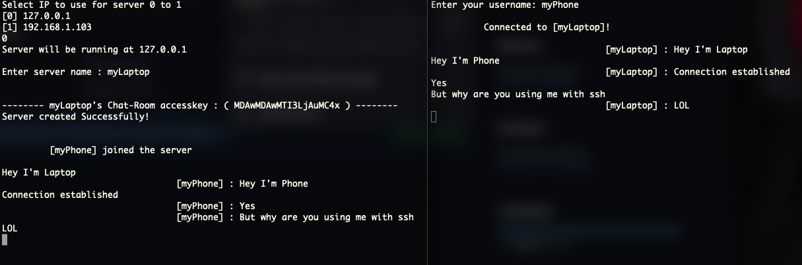

# Route NetCom

## How to use it
Server Side:
```bash
python3 server.py
```
Client Side:
```bash
python3 client.py (key)
#here key is provided by server after execution
```

## Sample Output
Two different Devices were connected to perform this demo
1. Laptop(Macbook)
2. Phone(using ssh)


